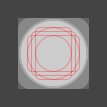
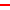

# react-native-svg-app-icon

CLI tool for generating iOS and Android application launcher icons for React Native projects from a single SVG source file.

Features include:

- iOS – PNG icon generation
- Android – vector drawable adaptive icon generation with PNG fallback
- Android pre 8.0 – legacy square and circular icon generation

Source foreground and background images


are converted to platform-specific icons


For more information on outputs, see the [generated files](docs/generated_files.md) docs.

➰ If you also want to use SVG images within your React Native application, you might want to check out [react-native-svg-asset-plugin](https://github.com/aeirola/react-native-svg-asset-plugin).

## Quick start

Create an 108x108dp SVG file with your logo in the center 66dp. It should follow the Android [adaptive icon guidelines](https://developer.android.com/develop/ui/views/launch/icon_design_adaptive#design-adaptive-icons). Then run the following command in your react native project root to generate all necessary images:

```sh
npx react-native-svg-app-icon --foreground-path app-icon.svg
```

You can add the generated files to your repo from this one-time run, or alternatively follow installation and usage instructions below to integrate icon generation in your build steps.

## Installation

```bash
npm install --save-dev react-native-svg-app-icon
```

SVG rendering handled by the splendid [`sharp`](https://github.com/lovell/sharp) library, meaning no dependencies outside of npm are required.

Requires node version 20, or later.

## Usage

### Prepare source file

The source file should be an 108x108dp SVG with the main content within the center 66dp that follows the [Android adaptive icon specification](https://developer.android.com/guide/practices/ui_guidelines/icon_design_adaptive).

For an example icon file, see [`example-rn/icon.svg`](example-rn/icon.svg). Or the official [Figma Template](https://www.figma.com/community/file/1131374111452281708/android-app-icons).

### Generate icons

Place your square 108x108 SVG app icon file named `icon.svg` in the project root and run

```bash
npx react-native-svg-app-icon
```

This will generate all the required icons under the `android/` and `ios/` directories.

- `android/`
  - `app/src/main/res/`
    - `drawable-anydpi-v26/`
      - `ic_launcher_background.xml`
      - `ic_launcher_foreground.xml`
    - `mipmap-anydpi-v26/`
      - `ic_launcher_round.xml`
      - `ic_launcher.xml`
    - `mipmap-*dpi/`
      - `ic_launcher_round.png`
      - `ic_launcher.png`
- `ios/`
  - `<app-name>/Images.xcassets/`
    - `AppIcon.appiconset/`
      - `Contents.json`
      - `ios-*.png`
      - `ipad-*.png`
      - `iphone-*.png`

### Git

If you generate the icons in a build step, such as npm [`prepare` script](https://docs.npmjs.com/cli/v11/using-npm/scripts#prepare-and-prepublish), and don't want to keep generated images in your repository, you can ignore them with

```gitignore
# react-native-svg-app-icon
android/app/src/*/res/*/ic_launcher*
ios/*/*.xcassets/AppIcon.appiconset
```

### Examples

Check [`example-rn/`](./example-rn/) for use in a plain React Native project, and [`example-expo/`](./example-expo/) for use in an [Expo](https://expo.dev) project.

### Icon format

Specifically, the image should:

- Be a valid SVG image
- Have a 1:1 aspect ratio
- Have a size of 108x108dp

of which the:

- Center 72x72dp square is the normally visible area
- Center 66dp diameter circle is the safe area which will always be visible

With the various icons cropped according to the following image



-  Overflow area
-  Visible area
-  iOS / Android legacy square crop
-  Android legacy circular crop
-  Safe area
-  Icon keylines

### Icon background

If you want to use a separate background layer for Android adaptive icons, or because your source icon file doesn't contain a background, you can create an `icon-background.svg` file which will be used as the background layer for the generated icons. Usually this might just be a solid color, as in [`example-rn/icon-background.svg`](example-rn/icon-background.svg), or a gradient. But you can go wild and use patterns or elaborate backgrounds as well.

If the foreground is transparent, and no background is specified, then a white background is used.

In case you want to produce both foreground and background layers from a single SVG file, you can use [svg-deconstruct](https://github.com/not-fred/svg-deconstruct) to split layers to separate files. See configuration section below on how to specify input file paths.

## Configuration

Behaviour can be configured in the `app.json` under the `svgAppIcon` field. For example if you want to store icon layers under an `icon/` directory, you might want to use:

```json
{
  "name": "example",
  "displayName": "example",
  "svgAppIcon": {
    "foregroundPath": "./icon/icon-foreground.svg",
    "backgroundPath": "./icon/icon-background.svg",
    "platforms": ["ios"],
    "force": false,
    "androidOutputPath": "./android/app/src/main/res",
    "iosOutputPath": "./ios/MyAppName/Images.xcassets/AppIcon.appiconset",
    "logLevel": "info"
  }
}
```

Supported configuration values are

| Field               | Default                                               | Description                                                                                                                                                     |
| ------------------- | ----------------------------------------------------- | --------------------------------------------------------------------------------------------------------------------------------------------------------------- |
| `foregroundPath`    | `"./icon.svg"`                                        | Input file path for the foreground layer. File needs to exist, and may contain transparency.                                                                    |
| `backgroundPath`    | `"./icon-background.svg"`                             | Input file path for the background layer. File doesn't need to exist, and will default to a fully white background. If the file exists, it needs to be fully opaque. |
| `platforms`         | `["android", "ios"]`                                  | Array of platforms for which application launcher icons should be generated. Possible values are `android` and `ios`.                                           |
| `force`             | `false`                                               | When `true`, output files will always be written even if they are newer than the input files.                                                                   |
| `androidOutputPath` | `./android/app/src/main/res`                          | Where to place generated Android icons, can be used for flavor-specific icon generation                                                                         |
| `iosOutputPath`     | `./ios/<app-name>/Images.xcassets/AppIcon.appiconset` | Where to place generated iOS icons. Uses `name` field from `app.json` if available, otherwise defaults to first target with an Images.xcassets folder           |
| `logLevel`          | `"info"`                                              | Controls the verbosity of logging output. Possible values are `silent`, `error`, `warn`, `info`, and `debug`.                                                   |

Alternatively, the configuration parameters can also be set as CLI flags. See `react-native-svg-app-icon --help` for details.

## Rationale

React Native aims to provide tools for building cross platform native mobile applications using technologies familiar from web development. Since the core tooling doesn't provide a solution for building the launcher icons for those applications, this tool aims to fill that gap.

Luckily, most icons follow a similar structure of a foreground shape on a background, which is easily adapted to different shapes and sizes. This is the idea behind Android [Adaptive Icons](https://developer.android.com/guide/practices/ui_guidelines/icon_design_adaptive), and what the [Android Image Asset Studio](https://developer.android.com/studio/write/image-asset-studio) implements nicely for generating legacy icons. This tool can actually be thought of as a NPM CLI port of the Image Asset Studio, with added support for generating iOS icons as well.

### Other work

Most existing solutions are centered around the idea of scaling PNG images.

- [Expo](https://docs.expo.dev/develop/user-interface/splash-screen-and-app-icon/#app-icon): Scales PNG files generating the required iOS and Android variants, but requires users to supply platform specific PNGs in order to adhere to platform icon design guidelines.
- [Icon Kitchen](https://icon.kitchen/): Web tool to generate images. Files need to be placed manually in the repository, unable to integrate with build tooling.
- [app-icon](https://github.com/dwmkerr/app-icon): Similar to Expo, with some added features such as labeling the icons. Requires imagemagick.

## Troubleshooting

### Android adaptive icons are not vector drawables

All SVG features cannot be converted to android vector drawables. Using advanced SVG features, such as masks or text, will cause adaptive icons to be generated using PNG fallbacks instead. See [VectorDrawable](https://developer.android.com/reference/android/graphics/drawable/VectorDrawable) specification for supported features, and [svg2vectordrawable](https://github.com/Ashung/svg2vectordrawable) for the conversion behaviour.

### SVG text is not rendered with the correct font

SVG fonts are loaded from the OS, so the font needs to be available on all systems that generate the icons. Unfortunately embedded SVG fonts are not supported, see [sharp#2838](https://github.com/lovell/sharp/issues/2838). Prefer to use shapes instead of text elements if possible.

### Supported SVG features

Most common SVG features are supported, including masks and styles. SVGs are rasterized to PNGs using the [sharp](https://github.com/lovell/sharp) Node.js library, which is based on [libvips](https://github.com/libvips/libvips) C library, which includes the [librsvg](https://github.com/GNOME/librsvg) library that renders the SVG images.

For complete information about supported SVG features, see the [`librsvg` documentation](https://gnome.pages.gitlab.gnome.org/librsvg/devel-docs/features.html).
