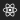

# Generated images

All images are generated from a single source file, but are processed in different ways to produce optimal results for eacth platform and device.

This document describes the different images being produced.

## Android

Android icons consist of the newer [adaptive icons](https://developer.android.com/guide/practices/ui_guidelines/icon_design_adaptive) for Android 8.0+, and the [legacy](https://material.io/design/iconography/product-icons.html) round and square icons for older versions of the platform.

### Adaptive icon

Adaptive icons consist of a partially transparent foreground layer and solid background layer, which are rendered on top of each other to produce a final icon. In theory this enables interesting parallax effects, but in pratice these effects are never seen by the user. Thus, for simplicity, the whole icon is rendered in the foregraound layer, leaving the background layer unused. If multilayer support is something that is needed, don't hesitate to create an issue.

This foreground layer is generated as vector drawable icons when possible, with fallback to PNG images in case the SVG source images contains incompatible content.

Regardless of the foreground format, the adaptive icon file is produced which specifies the correct background and foreground layers:

`mipmap-anydpi-v26/ic_launcher.xml`

```xml
<?xml version="1.0" encoding="utf-8"?>
<adaptive-icon xmlns:android="http://schemas.android.com/apk/res/android">
    <background android:drawable="@android:color/white" />
    <foreground android:drawable="@drawable/ic_launcher_foreground" />
</adaptive-icon>
```

#### Vector drawable foreground

The foreground is generated as a [vector drawable](https://developer.android.com/guide/topics/graphics/vector-drawable-resources) for simple SVG input where all the visual content can be represented as vector drawable elements. For a full list of supported elements in the vector drawable specification, see the [reference](https://developer.android.com/reference/android/graphics/drawable/VectorDrawable.html) documentation.

Vector drawable icons are generated using the [svg2vectordrawable](https://github.com/Ashung/svg2vectordrawable) library. In case there are problems with the output vector drawable, please check for information in that library.

`drawable-anydpi-v26/ic_launcher_foreground.xml`

```xml
<vector xmlns:android="http://schemas.android.com/apk/res/android"
    android:width="108dp"
    android:height="108dp"
    android:viewportWidth="108"
    android:viewportHeight="108">
    <path
        android:fillColor="#222"
        android:pathData="M0 0h108v108H0V0z"/>
    <path
        android:fillColor="#FFF"
        android:pathData="M58.83 53.83a4..."/>
    <path
        android:fillColor="#FFF"
        android:pathData="M80 53.83c0-3...."/>
</vector>
```

#### PNG fallback foreground

In case the input SVG contains elements not supported by vector drawable, such as `<text>`, then the foreground is rendered as a normal PNG images for each density, which would look like this:


### Legacy icons

Traditional Android launcher icons have lacked enforced design guidelines, and are allowed to have basically any shape. Here, the icons are generated similarly to the [Image asset studio](https://developer.android.com/studio/write/image-asset-studio) whit cropping and shading applied according to the [Material design](https://material.io/design/iconography/) guidelines. This means that there is an appropriate transparent margin around the icons, with drop shadows added to mimic

PNG icons are generated for all different [densities](https://developer.android.com/training/multiscreen/screendensities.html#TaskProvideAltBmp), from `mdpi` to `xxxhdpi`.

### Square

Normal legacy icons supported by all Android versions.

`mipmap-#dpi/ic_launcher.png`


### Round

Android 7.1 included support for defining specifically circular launcher icons. These are rendered separately from the square format for consistent style on all platforms.

`mipmap-#dpi/ic_launcher_round.png`


## iOS

All iOS images follow the same square cropped shape without any transparency, with rounder corners produced by the platform. The source image is cropped according to the Android adaptive icon viewport (center 2/3), providing consistent icons across all platforms.

Icons are generated for all devices supported by React Native, meaning iPhones and iPads running iOS 9 or later.

### iPhone


### iPad




### Marketing icon


